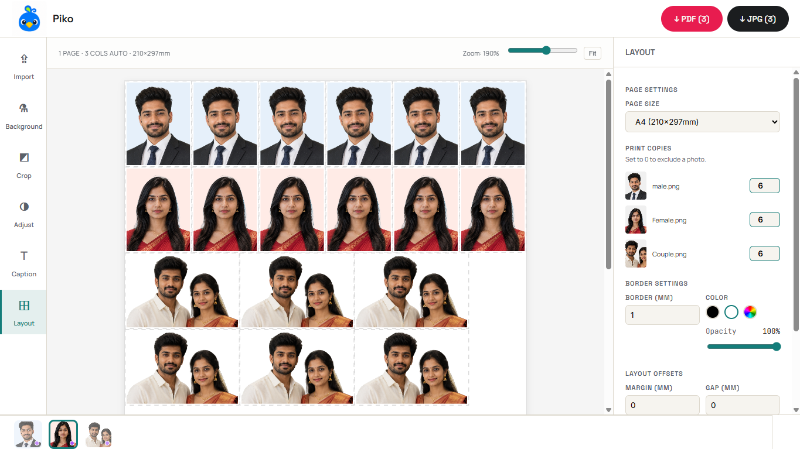
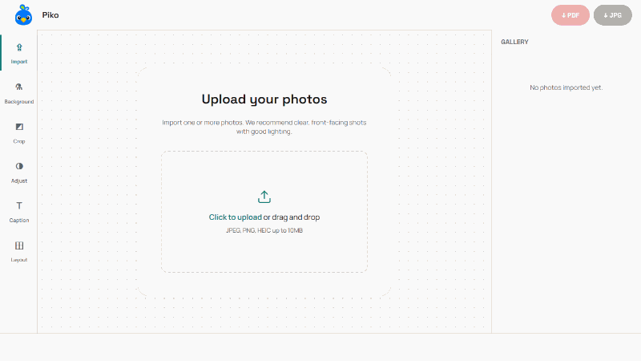

<div align="center">
  

# PIKO

  **The Professional, Privacy-First ID Photo Studio in Your Browser**

  [](#)
  [](#)
  [](#)

</div>

<br />

## 🚨 The Problem

Getting a perfectly formatted passport, visa, or official ID photo is surprisingly tedious. 

- **For Photo Shop Workers:** Creating ID photos is heavily manual. It requires opening bulky software like Photoshop, manually importing photos, manually cropping to exact millimeter sizes, manually removing backgrounds, and meticulously copy-pasting and arranging multiple photos on an A4/4x6 sheet just to print.
- **For Individuals:** Physical studios are expensive and inconvenient. Meanwhile, online tools force you to upload highly sensitive, personal photos to their cloud servers, plaster their branding over your photos, lock high-resolution exports behind paywalls, or fail to arrange multiple photos efficiently for standard paper printing.

## 💡 The Solution

**PIKO** is a sleek, completely local web application that turns any casual portrait into a print-ready, strictly formatted ID photo sheet in seconds.

By leveraging cutting-edge in-browser AI (WebGPU/WASM), PIKO performs flawless background removal **without your photos ever leaving your device**. Crop to exact millimeter specifications, apply uniform borders, arrange them smartly on standard paper sizes, and export pixel-perfect 300-DPI files ready for your home printer or a local print shop.

### Core Features

- 🔒 **Zero-Server Privacy:** 100% of processing, including AI background removal, happens locally on your machine.
- ✂️ **Smart AI Cutouts:** Instantly remove backgrounds and replace them with standard white, blue, or custom colors.
- 📐 **Precision Cropping:** Crop photos to exact millimeter dimensions required by governments worldwide (e.g., 35x45mm).
- 🖨️ **Intelligent Layout Engine:** Automatically packs your photos onto standard paper formats (A4, 4x6", 5x7") for cheap and efficient printing.
- 🔤 **Dynamic Captions & Cut-lines:** Add overlay text (like names or classes) and dashed cut-lines for precise scissor-cutting.

---

## 🚀 How to Use

PIKO is designed to be frictionless and intuitive. Follow the 5-step pipeline:

1. **Import:** Drag and drop your photos into the app.
2. **Background:** Use the one-click AI tool to remove distracting backgrounds and apply a solid color. (OR *SKIP IF YOU WANT*)
3. **Crop:** Select your required dimensions (e.g., Passport, PAN, Stamp) and align your face.
4. **Adjust & Caption:** Tweak brightness and contrast, and add optional text labels to your photos.
5. **Layout:** Select your paper size, adjust margins, and export a 300-DPI PDF or JPG to print.

---

## 🖼️ What the Output Looks Like

PIKO generates a perfectly spaced, high-resolution layout grid.

<!-- Replace with an actual screenshot of the final layout export -->

<div align="center">
  
  <p><em>Example: Six 35x45mm photos automatically tiled onto a 4x6" print sheet with cutting guidelines.</em></p>
</div>

<!-- Gif video showing the entire pipeline working in browser -->
<div align="center">
  
</div>
---

## 🛠️ Tech Stack & Development

PIKO is built with modern, high-performance web technologies:

- **Framework:** React + TypeScript
- **Bundler:** Vite
- **Styling:** Custom CSS (Zero heavy UI libraries for maximum speed)
- **AI Processing:** `@huggingface/transformers` running via ONNX Runtime Web (WebGPU & WASM)
- **Canvas Engine:** Native HTML5 Canvas for pristine 300-DPI vector-quality exports.

### Running Locally

```bash
# 1. Clone the repository
git clone https://github.com/srsoumyax11/piko

# 2. Install dependencies (Bun recommended)
bun install

# 3. Start the development server
bun run dev

# 4. Build for production
bun run build
```
